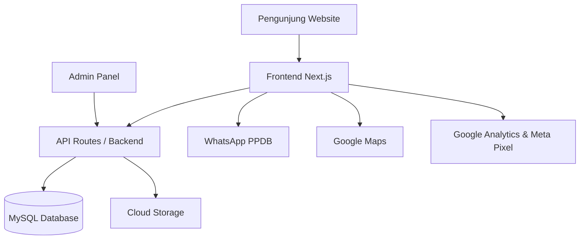

# PRD — Website SMK Pariwisata PGRI Majalengka

## 1. Overview

**SMK Pariwisata PGRI Majalengka** adalah website profil sekolah dan media informasi PPDB yang dirancang untuk memperkenalkan identitas sekolah, program keahlian, kegiatan, fasilitas, prestasi, serta memudahkan calon siswa/orang tua untuk menghubungi admin sekolah melalui WhatsApp.

Website ini dibuat dengan konsep **modern, mobile-first, informatif, SEO-friendly, dan fokus pada konversi PPDB**. Struktur website dibuat lebih sederhana dengan **8 halaman utama** agar mudah dikelola, tidak terlalu berat, dan tetap lengkap untuk kebutuhan branding sekolah.

Nama resmi yang ditemukan di data pendidikan adalah **SMKS PGRI Majalengka**, sedangkan branding publik yang digunakan adalah **SMK Pariwisata PGRI Majalengka**.

---

## 2. Research Summary

Berdasarkan riset awal dari sumber publik, data sekolah yang ditemukan:

- **Nama resmi:** SMKS PGRI Majalengka
- **Branding publik:** SMK Pariwisata PGRI Majalengka
- **NPSN:** 20247188
- **Status:** Swasta
- **Bentuk pendidikan:** SMK
- **Alamat:** Jl. Suma No. 481, Babakan Jawa, Kecamatan Majalengka, Kabupaten Majalengka, Jawa Barat
- **Telepon:** 0233281647
- **Email publik:** smk.pariwisata@gmail.com / smkprwst@gmail.com
- **Website/blog publik:** smk-pariwisata-pgri-mjl.blogspot.com
- **Kurikulum/program yang muncul di sumber publik:** SMK Merdeka Perhotelan
- **Akreditasi:** A berdasarkan data publik Sekolah Kita

Data ini harus tetap diverifikasi ulang oleh pihak sekolah sebelum website dipublikasikan.

---

## 3. Goals

Tujuan utama website:

1. **Meningkatkan kepercayaan calon siswa dan orang tua**
   - Menampilkan profil sekolah secara profesional.
   - Menampilkan jurusan, fasilitas, kegiatan, prestasi, dan kontak resmi.

2. **Mendukung PPDB**
   - Menyediakan informasi pendaftaran yang jelas.
   - Mengarahkan calon siswa/orang tua ke WhatsApp admin PPDB.
   - Menyimpan data leads calon siswa melalui form minat.

3. **Memperkuat branding sekolah**
   - Menonjolkan identitas sekolah pariwisata/perhotelan.
   - Menampilkan dokumentasi kegiatan praktik, hospitality, tata boga, perhotelan, dan kegiatan siswa.

4. **Meningkatkan visibilitas di Google**
   - Website dioptimasi untuk pencarian:
     - SMK Pariwisata Majalengka
     - SMK Perhotelan Majalengka
     - SMK PGRI Majalengka
     - PPDB SMK Majalengka
     - SMK Swasta Majalengka

---

## 4. Target Users

### 4.1 Calon Siswa SMP/MTs
Membutuhkan informasi yang singkat, visual menarik, dan mudah dipahami tentang jurusan, kegiatan sekolah, serta cara daftar.

### 4.2 Orang Tua/Wali
Membutuhkan informasi resmi seperti profil sekolah, alamat, akreditasi, fasilitas, biaya/PPDB, kontak, dan prospek jurusan.

### 4.3 Admin Sekolah/PPDB
Membutuhkan sistem sederhana untuk mengelola konten dan melihat data calon siswa yang masuk dari website.

### 4.4 Alumni dan Mitra
Membutuhkan informasi sekolah, kegiatan, dan peluang kerja sama.

---

## 5. Website Pages — 8 Halaman Utama

Website hanya menggunakan **8 halaman utama** agar struktur lebih rapi, ringan, dan mudah dikembangkan.

### 5.1 Beranda

Halaman utama untuk branding dan konversi PPDB.

Konten:
- Hero section.
- Headline utama.
- Subheadline.
- Tombol CTA:
  - Daftar PPDB Sekarang
  - Konsultasi via WhatsApp
- Ringkasan profil sekolah.
- Highlight keunggulan sekolah.
- Preview jurusan/program keahlian.
- Preview kegiatan/galeri.
- Preview berita terbaru.
- CTA akhir PPDB.

Contoh headline:
> **Bangun Masa Depan di Dunia Pariwisata & Perhotelan**

Contoh subheadline:
> SMK Pariwisata PGRI Majalengka membekali siswa dengan keterampilan, karakter, dan pengalaman praktik untuk siap kerja, kuliah, maupun berwirausaha.

---

### 5.2 Profil Sekolah

Halaman ini berisi informasi resmi sekolah.

Konten:
- Tentang sekolah.
- Sejarah singkat.
- Visi dan misi.
- Sambutan kepala sekolah.
- Identitas sekolah:
  - Nama sekolah
  - NPSN
  - Status
  - Alamat
  - Kontak
  - Email
  - Website/blog
- Akreditasi jika sudah diverifikasi.
- Struktur organisasi singkat.
- Foto sekolah.

Tujuan halaman:
- Membangun kepercayaan orang tua.
- Menampilkan legalitas dan identitas sekolah.
- Menjadi halaman SEO untuk kata kunci nama sekolah.

---

### 5.3 Jurusan / Program Keahlian

Halaman ini menjelaskan program keahlian utama sekolah, terutama bidang pariwisata/perhotelan.

Konten:
- Deskripsi jurusan.
- Kompetensi yang dipelajari:
  - Front office.
  - Housekeeping.
  - Food & beverage service.
  - Tata boga dasar.
  - Barista/hospitality skill.
  - Public speaking.
  - Bahasa Inggris pariwisata.
  - Grooming dan etika pelayanan.
- Kegiatan praktik siswa.
- Prospek kerja:
  - Hotel.
  - Restoran.
  - Travel.
  - Event organizer.
  - Kapal pesiar.
  - Industri hospitality.
  - Wirausaha kuliner/pariwisata.
- Foto/video praktik.
- Tombol “Tanya Jurusan Ini”.

Tujuan halaman:
- Membantu calon siswa memahami pilihan jurusan.
- Membantu orang tua melihat peluang masa depan anak.
- Meningkatkan minat mendaftar.

---

### 5.4 PPDB

Halaman PPDB menjadi halaman konversi utama website.

Konten:
- Informasi PPDB tahun ajaran terbaru.
- Jadwal pendaftaran.
- Syarat pendaftaran.
- Alur pendaftaran.
- Biaya pendaftaran/biaya awal jika ingin ditampilkan.
- Form minat calon siswa:
  - Nama calon siswa
  - Asal sekolah
  - Nama orang tua
  - Nomor WhatsApp
  - Jurusan diminati
  - Catatan tambahan
- FAQ PPDB.
- Tombol WhatsApp admin PPDB.

Alur form:
1. Calon siswa/orang tua mengisi form.
2. Data masuk ke database.
3. Admin melihat data di dashboard.
4. Pengunjung diarahkan ke WhatsApp.
5. Admin follow up secara manual.

Contoh pesan WhatsApp otomatis:
```txt
Halo Admin SMK Pariwisata PGRI Majalengka, saya ingin bertanya tentang PPDB.

Nama calon siswa:
Asal sekolah:
Jurusan diminati:
```

---

### 5.5 Fasilitas

Halaman ini menampilkan fasilitas sekolah secara visual.

Konten:
- Ruang kelas.
- Ruang praktik.
- Lab/ruang simulasi perhotelan jika tersedia.
- Area praktik hospitality.
- Perpustakaan.
- Mushola.
- Lapangan/area kegiatan.
- Ruang guru.
- Fasilitas pendukung lainnya.

Setiap fasilitas menampilkan:
- Nama fasilitas.
- Deskripsi singkat.
- Foto.
- Kategori.

Tujuan halaman:
- Meyakinkan orang tua bahwa sekolah memiliki lingkungan belajar yang memadai.
- Menampilkan suasana sekolah secara nyata.

---

### 5.6 Galeri & Kegiatan

Halaman ini menggabungkan galeri foto dan dokumentasi kegiatan sekolah agar tidak terlalu banyak halaman.

Konten:
- Foto kegiatan belajar.
- Foto praktik jurusan.
- Foto event sekolah.
- Foto kegiatan PPDB.
- Foto kunjungan industri/PKL.
- Foto ekstrakurikuler.
- Video kegiatan jika tersedia.

Fitur:
- Filter kategori.
- Grid galeri.
- Lightbox preview.
- Video embed YouTube/Instagram jika diperlukan.

Tujuan halaman:
- Menunjukkan bahwa sekolah aktif.
- Memberikan bukti visual kegiatan siswa.
- Memperkuat branding sekolah.

---

### 5.7 Berita & Prestasi

Halaman ini menggabungkan berita sekolah dan prestasi agar struktur website tetap ringkas.

Konten berita:
- Kegiatan sekolah.
- Informasi PPDB.
- Kegiatan praktik.
- Kegiatan siswa.
- Kunjungan industri.
- Pengumuman.

Konten prestasi:
- Prestasi siswa.
- Prestasi guru.
- Prestasi sekolah.
- Sertifikat/penghargaan.
- Dokumentasi lomba.

Struktur artikel:
- Judul.
- Thumbnail.
- Tanggal publikasi.
- Kategori.
- Isi artikel.
- Meta description.
- Related posts.

Tujuan halaman:
- Membuat website terlihat aktif.
- Membantu SEO melalui artikel.
- Menampilkan kredibilitas sekolah.

---

### 5.8 Kontak & Lokasi

Halaman ini memudahkan pengunjung menghubungi sekolah.

Konten:
- Alamat lengkap.
- Nomor telepon.
- Nomor WhatsApp.
- Email.
- Google Maps embed.
- Jam operasional.
- Link media sosial.
- Form kontak sederhana.
- CTA:
  - Hubungi Admin PPDB
  - Lihat Lokasi Sekolah

Tujuan halaman:
- Memudahkan orang tua datang ke sekolah.
- Memudahkan calon siswa bertanya.
- Menampilkan kontak resmi agar lebih terpercaya.

---

## 6. Main Features

### 6.1 Floating WhatsApp Button
Tombol WhatsApp melayang di seluruh halaman.

Posisi:
- Desktop: kanan bawah.
- Mobile: sticky bottom.

CTA:
- Tanya PPDB
- Tanya Biaya
- Konsultasi Jurusan
- Hubungi Admin

---

### 6.2 Form PPDB / Form Minat

Form sederhana untuk mengumpulkan leads.

Field:
- Nama calon siswa.
- Asal sekolah.
- Nama orang tua.
- Nomor WhatsApp.
- Jurusan diminati.
- Pesan/catatan.

Output:
- Data tersimpan di database.
- Admin bisa melihat di dashboard.
- Pengunjung diarahkan ke WhatsApp.

---

### 6.3 Admin Panel

Admin panel dibuat sederhana untuk mengelola konten.

Fitur admin:
- Login admin.
- Dashboard ringkasan.
- Kelola profil sekolah.
- Kelola jurusan.
- Kelola fasilitas.
- Kelola galeri.
- Kelola berita & prestasi.
- Kelola leads PPDB.
- Export leads ke CSV/Excel.
- Pengaturan kontak dan WhatsApp.

---

### 6.4 SEO & Analytics

Fitur SEO:
- Meta title.
- Meta description.
- URL slug SEO-friendly.
- Alt text gambar.
- Sitemap.xml.
- Robots.txt.
- Open Graph image.
- Schema markup sekolah.

Tracking:
- Google Analytics.
- Google Search Console.
- Meta Pixel.
- Tracking klik WhatsApp.
- Tracking submit form PPDB.

---

## 7. User Flow

### 7.1 Flow Calon Siswa
1. Calon siswa membuka website dari Google/Instagram/WhatsApp.
2. Masuk ke halaman Beranda.
3. Melihat jurusan dan kegiatan sekolah.
4. Membuka halaman Jurusan.
5. Tertarik dengan program sekolah.
6. Klik “Daftar PPDB Sekarang”.
7. Mengisi form atau langsung WhatsApp admin.
8. Admin melakukan follow up.

### 7.2 Flow Orang Tua
1. Orang tua mencari informasi SMK di Majalengka.
2. Membuka website sekolah.
3. Membaca profil, fasilitas, jurusan, dan PPDB.
4. Melihat lokasi sekolah.
5. Klik “Tanya Biaya / Konsultasi PPDB”.
6. Terhubung ke WhatsApp admin.

### 7.3 Flow Admin
1. Admin login.
2. Admin menambah berita/galeri/fasilitas.
3. Admin melihat leads PPDB.
4. Admin mengubah status leads.
5. Admin export data jika dibutuhkan.
6. Admin follow up calon siswa melalui WhatsApp.

---

## 8. Information Architecture

Menu utama:

1. Beranda
2. Profil Sekolah
3. Jurusan
4. PPDB
5. Fasilitas
6. Galeri & Kegiatan
7. Berita & Prestasi
8. Kontak

Footer:
- Logo sekolah.
- Deskripsi singkat.
- Alamat.
- Kontak.
- Email.
- Link media sosial.
- Link cepat.
- Copyright.

---

## 9. UX/UI Direction

### 9.1 Style
Website harus terlihat:
- Modern.
- Bersih.
- Ramah pendidikan.
- Profesional.
- Mobile-friendly.
- Tidak terlalu ramai.
- Mudah dipahami siswa dan orang tua.

### 9.2 Warna
Rekomendasi warna:
- Primary: `#1F7A4D` — hijau sekolah/pariwisata.
- Secondary: `#F5B942` — emas/kuning hangat.
- Background: `#FFFFFF`.
- Soft Background: `#F6F8F7`.
- Text Primary: `#1F2937`.
- Text Secondary: `#6B7280`.

Jika sekolah memiliki warna resmi, warna mengikuti identitas sekolah.

### 9.3 Font
Rekomendasi:
- Heading: Poppins / Plus Jakarta Sans.
- Body: Inter / Poppins.

### 9.4 Komponen UI
- Navbar sticky.
- Hero banner.
- Card jurusan.
- Card fasilitas.
- Gallery grid.
- Badge PPDB.
- CTA button.
- Floating WhatsApp.
- Accordion FAQ.
- Form PPDB.
- Admin table.

---

## 10. SEO Requirements

Target kata kunci:
- SMK Pariwisata Majalengka.
- SMK Pariwisata PGRI Majalengka.
- SMK PGRI Majalengka.
- SMK Perhotelan Majalengka.
- SMK Swasta Majalengka.
- PPDB SMK Majalengka.
- SMK jurusan pariwisata di Majalengka.
- SMK jurusan perhotelan di Majalengka.

Contoh meta homepage:
- **Title:** SMK Pariwisata PGRI Majalengka | Sekolah Pariwisata & Perhotelan
- **Description:** Website resmi SMK Pariwisata PGRI Majalengka. Informasi profil sekolah, jurusan, fasilitas, kegiatan, prestasi, dan PPDB terbaru.

---

## 11. Architecture

Website menggunakan arsitektur modern berbasis Next.js. Pengunjung mengakses halaman publik, sedangkan admin mengelola konten melalui dashboard. Data disimpan di MySQL dan gambar disimpan di cloud storage.



---

## 12. Database Schema

### 12.1 `users`
Untuk akun admin.

| Field | Type | Description |
|---|---|---|
| id | INT PK | ID admin |
| name | VARCHAR | Nama admin |
| email | VARCHAR UNIQUE | Email login |
| password_hash | VARCHAR | Password terenkripsi |
| role | ENUM | super_admin/admin/editor |
| created_at | TIMESTAMP | Waktu dibuat |
| updated_at | TIMESTAMP | Waktu diperbarui |

---

### 12.2 `school_profile`
Untuk profil sekolah.

| Field | Type | Description |
|---|---|---|
| id | INT PK | ID profil |
| school_name | VARCHAR | Nama sekolah |
| npsn | VARCHAR | NPSN |
| address | TEXT | Alamat |
| phone | VARCHAR | Telepon |
| whatsapp | VARCHAR | WhatsApp |
| email | VARCHAR | Email |
| website | VARCHAR | Website |
| description | TEXT | Deskripsi |
| vision | TEXT | Visi |
| mission | TEXT | Misi |
| maps_embed_url | TEXT | Google Maps embed |

---

### 12.3 `majors`
Untuk jurusan/program keahlian.

| Field | Type | Description |
|---|---|---|
| id | INT PK | ID jurusan |
| name | VARCHAR | Nama jurusan |
| slug | VARCHAR UNIQUE | URL slug |
| short_description | TEXT | Deskripsi singkat |
| description | LONGTEXT | Detail jurusan |
| competencies | JSON | Kompetensi |
| career_prospects | JSON | Prospek kerja |
| thumbnail_url | VARCHAR | Gambar |
| is_active | BOOLEAN | Status tampil |

---

### 12.4 `facilities`
Untuk fasilitas.

| Field | Type | Description |
|---|---|---|
| id | INT PK | ID fasilitas |
| name | VARCHAR | Nama fasilitas |
| slug | VARCHAR UNIQUE | URL slug |
| description | TEXT | Deskripsi |
| image_url | VARCHAR | Foto |
| category | VARCHAR | Kategori |
| is_active | BOOLEAN | Status tampil |

---

### 12.5 `galleries`
Untuk foto/video kegiatan.

| Field | Type | Description |
|---|---|---|
| id | INT PK | ID galeri |
| title | VARCHAR | Judul |
| category | VARCHAR | Kategori |
| description | TEXT | Deskripsi |
| media_type | ENUM | image/video |
| media_url | VARCHAR | URL media |
| thumbnail_url | VARCHAR | Thumbnail |
| created_at | TIMESTAMP | Waktu upload |

---

### 12.6 `posts`
Untuk berita dan prestasi.

| Field | Type | Description |
|---|---|---|
| id | INT PK | ID post |
| title | VARCHAR | Judul |
| slug | VARCHAR UNIQUE | URL slug |
| excerpt | TEXT | Ringkasan |
| content | LONGTEXT | Isi |
| thumbnail_url | VARCHAR | Thumbnail |
| type | ENUM | berita/prestasi |
| category | VARCHAR | Kategori |
| status | ENUM | draft/published |
| meta_title | VARCHAR | SEO title |
| meta_description | TEXT | SEO description |
| published_at | DATETIME | Tanggal publish |

---

### 12.7 `ppdb_leads`
Untuk calon siswa.

| Field | Type | Description |
|---|---|---|
| id | INT PK | ID lead |
| student_name | VARCHAR | Nama calon siswa |
| origin_school | VARCHAR | Asal sekolah |
| parent_name | VARCHAR | Nama orang tua |
| whatsapp_number | VARCHAR | Nomor WhatsApp |
| interested_major | VARCHAR | Jurusan diminati |
| message | TEXT | Catatan |
| source | VARCHAR | Sumber lead |
| status | ENUM | new/contacted/registered/closed/lost |
| created_at | TIMESTAMP | Waktu masuk |

---

## 13. Tech Stack

### Frontend
- Next.js
- React
- Tailwind CSS
- shadcn/ui
- Lucide Icons
- Framer Motion

### Backend
- Next.js API Routes
- Node.js
- REST API

### Database
- MySQL
- Drizzle ORM / Prisma

### Authentication
- Better Auth / JWT session
- Role admin:
  - super_admin
  - admin
  - editor

### Image Storage
- Cloudinary / Vercel Blob / S3 compatible storage

### Deployment
- Vercel untuk frontend/backend
- MySQL Hostinger/Railway/VPS
- Custom domain sekolah

### Analytics
- Google Analytics 4
- Google Search Console
- Meta Pixel

---

## 14. Non-Functional Requirements

### Performance
- Lighthouse performance minimal 85.
- Gambar menggunakan WebP/AVIF.
- Lazy loading untuk gambar.
- Optimasi font.
- Caching halaman publik.

### Security
- Password admin harus di-hash.
- Validasi form frontend dan backend.
- Rate limit form PPDB.
- Proteksi upload file.
- Role-based access control.
- Backup database berkala.

### Accessibility
- Kontras warna jelas.
- Alt text pada gambar.
- Form memiliki label.
- Tombol mudah diklik di mobile.
- Navigasi mudah dipahami.

---

## 15. MVP Scope

MVP wajib mencakup:

- 8 halaman publik:
  1. Beranda
  2. Profil Sekolah
  3. Jurusan
  4. PPDB
  5. Fasilitas
  6. Galeri & Kegiatan
  7. Berita & Prestasi
  8. Kontak
- Floating WhatsApp.
- Form PPDB.
- Admin login.
- Admin kelola galeri.
- Admin kelola berita/prestasi.
- Admin lihat data PPDB leads.
- SEO dasar.
- Google Analytics.
- Deployment ke domain sekolah.

---

## 16. Out of Scope for MVP

Fitur berikut tidak wajib di versi awal:

- Portal siswa.
- Portal guru.
- E-learning.
- Pembayaran online.
- Absensi online.
- Sistem nilai.
- Chatbot AI.
- Multi-language.
- Upload dokumen PPDB lengkap.
- Integrasi WhatsApp API otomatis.

---

## 17. Development Roadmap

### Phase 1 — Setup
- Setup Next.js.
- Setup Tailwind CSS.
- Setup shadcn/ui.
- Setup database.
- Setup layout utama.

### Phase 2 — Public Website
- Beranda.
- Profil.
- Jurusan.
- PPDB.
- Fasilitas.
- Galeri & Kegiatan.
- Berita & Prestasi.
- Kontak.

### Phase 3 — Admin Panel
- Login admin.
- Dashboard.
- CRUD galeri.
- CRUD berita/prestasi.
- Kelola leads PPDB.
- Pengaturan kontak.

### Phase 4 — SEO & Tracking
- Meta title/description.
- Sitemap.
- Robots.txt.
- Schema markup.
- Google Analytics.
- Meta Pixel.

### Phase 5 — Deployment
- Testing mobile.
- Testing form.
- Testing CTA WhatsApp.
- Optimasi gambar.
- Deploy production.
- Hubungkan domain.

---

## 18. Success Metrics

Website dianggap berhasil jika:

- Klik WhatsApp PPDB meningkat.
- Leads PPDB masuk melalui form.
- Website tampil di Google untuk kata kunci sekolah.
- Pengunjung membuka halaman Jurusan dan PPDB.
- Admin dapat mengelola konten sendiri.
- Website cepat dibuka di HP.
- Orang tua mudah menemukan kontak dan lokasi sekolah.

Metric utama:
- WhatsApp click rate.
- Form submit rate.
- Organic traffic.
- Organic impressions.
- Average engagement time.
- Leads per month.
- Conversion dari lead ke pendaftar.

---

## 19. Acceptance Criteria

Website dianggap selesai jika:

- 8 halaman utama dapat diakses.
- Tampilan mobile dan desktop rapi.
- Tombol WhatsApp berfungsi.
- Form PPDB berhasil menyimpan data.
- Admin dapat login.
- Admin dapat mengelola galeri.
- Admin dapat mengelola berita/prestasi.
- Admin dapat melihat leads PPDB.
- SEO dasar sudah terpasang.
- Google Analytics aktif.
- Website berhasil dideploy ke domain.
- Loading homepage cepat.
- Data sekolah sudah diverifikasi oleh pihak sekolah.

---

## 20. Data yang Perlu Diminta ke Pihak Sekolah

Sebelum development final, minta pihak sekolah menyiapkan:

- Logo sekolah PNG/SVG.
- Foto gedung sekolah.
- Foto kegiatan terbaru.
- Foto praktik jurusan.
- Visi misi resmi.
- Sambutan kepala sekolah.
- Daftar jurusan resmi.
- Informasi PPDB terbaru.
- Nomor WhatsApp admin PPDB.
- Data fasilitas.
- Data prestasi.
- Link Instagram/TikTok/Facebook resmi.
- Struktur organisasi.
- Informasi biaya jika ingin ditampilkan.
